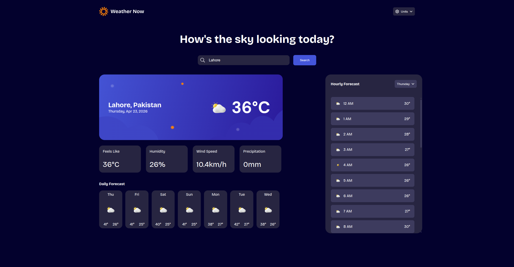

# Frontend Mentor - Weather App Solution

This is my solution to the [Weather app challenge on Frontend Mentor](https://www.frontendmentor.io/challenges/weather-app-K1FhddVm49).

## Overview

### The challenge

Users can:

- Search weather by location name
- View current weather conditions with icon, location, and date
- See detailed metrics: feels like, humidity, wind speed, and precipitation
- Browse a 7-day daily forecast
- View an hourly forecast for a selected day
- Switch unit systems (Imperial and Metric)
- Switch individual units for temperature, wind speed, and precipitation
- See loading, not-found, and API-error states
- Use the interface on desktop, tablet, and mobile layouts

### Screenshot

### Links

- Solution URL: Not published yet
- Live Site URL: Not deployed yet

## Features Implemented

- City search with debounced autocomplete suggestions
- Weather data fetched from Open-Meteo APIs
- Dynamic rendering for current, daily, and hourly forecasts
- Custom dropdowns for units and day selection
- Retry action for API failure state
- Responsive layouts:
  - Desktop
  - Tablet (single-column weather content flow)
  - Mobile (optimized card grids and spacing)

## Built With

- Semantic HTML5
- CSS3 (Flexbox and Grid)
- Vanilla JavaScript (ES6+)
- [Open-Meteo Geocoding API](https://open-meteo.com/en/docs/geocoding-api)
- [Open-Meteo Forecast API](https://open-meteo.com/en/docs)

## Project Structure

- `index.html` - App markup and layout structure
- `css/style.css` - Styling and responsive breakpoints
- `js/script.js` - Data fetching, rendering, and interactions
- `assets/images` - Icons and weather card backgrounds

## Getting Started

1. Clone or download this repository.
2. Open the project folder.
3. Run with any local server (for example, VS Code Live Server) and open `index.html`.

## What I Learned

- Managing async UI states clearly improves UX and debugging.
- Keeping rendering logic separated by section (current, daily, hourly) makes updates easier.
- Custom dropdowns need extra care for viewport boundaries and mobile behavior.
- Responsive behavior is more stable when each breakpoint has clear layout goals.

## Continued Development

- Improve accessibility for custom select components (keyboard support and ARIA behavior)
- Add persistent unit preferences with localStorage
- Improve performance with request cancellation and response caching
- Add tests for utility and rendering logic

## Useful Resources

- [Open-Meteo Documentation](https://open-meteo.com/en/docs)
- [MDN - Fetch API](https://developer.mozilla.org/en-US/docs/Web/API/Fetch_API)
- [MDN - CSS Grid Layout](https://developer.mozilla.org/en-US/docs/Web/CSS/CSS_grid_layout)

## AI Collaboration

I used GitHub Copilot as a development assistant for:

- Debugging layout and responsive CSS issues
- Iterating on tablet and mobile breakpoint behavior
- Refining UI edge cases (dropdown overflow, image/text overlap)

AI helped speed up iteration, while implementation decisions and testing were still done manually in the browser.

## Author

- Muhammad Abdullah

## Acknowledgments

- Challenge by [Frontend Mentor](https://www.frontendmentor.io)
